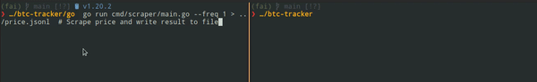

# bitcoin-price
Track bitcoin price and draw a live-chart

Two functionalities are implemented so far:  
✓ Scrape [current bitcoin price](https://coinbase.com) and print it to stdout  
✓ Render live price from file as a table (only python, using [Rich!✨](https://github.com/Textualize/rich))


This is a simple toy project I started with [Juan_X](https://github.com/JuanSeve) as an excuse to write some python/go/rust code 🧉✌️


## Usage: Scraping
### Go
Inside `/go`, run scraping and save output to file `price.jsonl`
```bash
go run cmd/scraper/main.go > price.jsonl
```

An optional parameter is the update frequency (in seconds), which you can change using the command line parameter `--freq` like so:
```bash
go run cmd/scraper/main.go --freq=2 > price.jsonl
```

### Python
Inside `/python`, create virtual environment and install dependencies:
```bash
python -m venv .venv
source .venv/bin/activate
python -m pip install -r requirements.txt
```
Run scraping and save output to file `price.jsonl`
```bash
python scraper.py > price.jsonl
```

An optional parameter is the update frequency (in seconds), which you can change using the command line parameter `--freq` like so:

```bash
python scraper.py --freq=5 > price.jsonl
```

### Rust
Inside `/rust`, run scraping and save output to file `price.jsonl`
```bash
cargo run --bin scraper > price.jsonl
```

An optional parameter is the update frequency (in seconds), which you can change using the command line parameter `--freq` like so:

```bash
cargo run --bin scraper -- --freq=2 > price.jsonl
```
Notice the intentional repetition of `--`.

## Usage: Live Chart
Make sure the Python library Rich is installed.
For example, installing it in the virtualenv created above in the `scraper` section (inside `/python`):
```bash
source .venv/bin/activate
python -m pip install rich
```
Run chart script passing the file from which the prices are read (for example `price.jsonl`):
```bash
python chart.py --filename price.jsonl
```

#### TODO
- error handling
- tests
